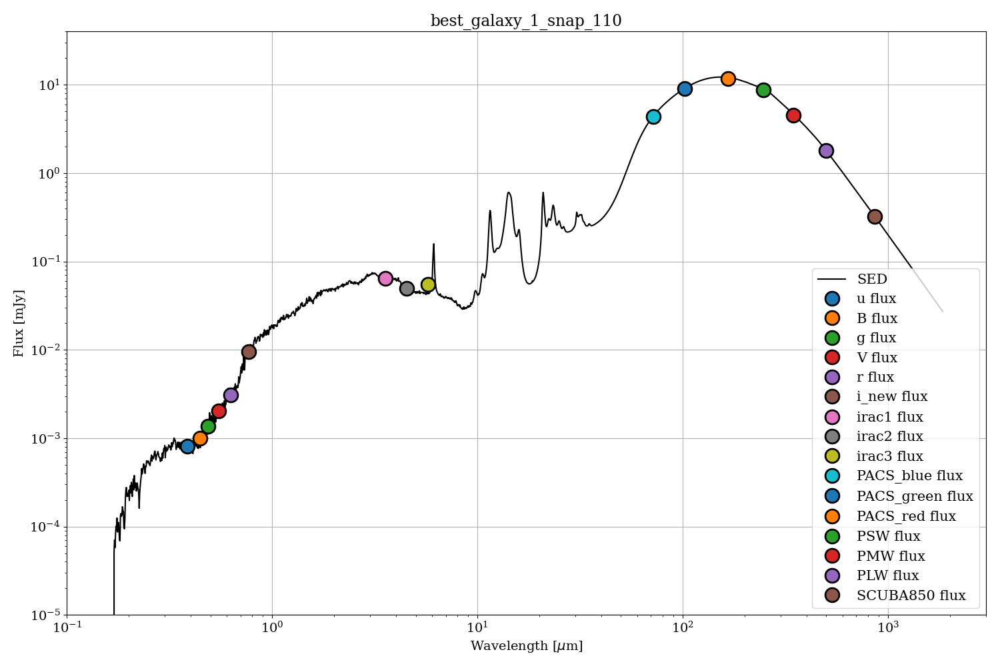

# 🌌 genSED — Galaxy SED Generator

A Python tool to generate **spectral energy distributions (SEDs)** from galaxy photometry and compute **FIR luminosity**, **dust temperature**, and **UV luminosity** using the *Casey (2012)* model.



---

## 📖 Overview

`genSED` reads galaxy photometry (in **mJy**) and produces:

- **Total far-infrared (FIR) luminosity** in solar units (L☉), by integrating over the rest-frame range of 8–1000 μm.  
- **Dust temperature** (K) using the modified greybody + power-law SED formulation from *Casey (2012)*.  
- **UV luminosity** (L☉) evaluated at rest-frame 1500 Å.

---

## 🧱 Project Structure
```
genSED/
│
├── README.md # Main program: generates SEDs
├── LICENSE # Reads and processes photometric input
├── sed/ # Utility functions and helpers
│ ├── conversion.py
│ └── sed.py
  └── suppliments\
  
├── tests/ # Unit tests (optional)
 
```

---

## 🧩 The Casey (2012) Model

The **Casey (2012)** far-infrared SED model combines a *modified greybody* and a *mid-infrared power-law* component.

### Functional Form

```math
S(\nu) \propto \left[ 1 - e^{-\tau(\nu)} \right] \, B(\nu, T) + A \, \nu^{-\alpha}
```

where:
- **B(ν, T)** — Planck function at temperature T  
- **τ(ν)** — optical depth = (ν / ν₀)^β  
- **β** — dust emissivity index (typically ~1.6)  
- **α** — mid-IR power-law slope (typically ~2.0)  
- **A** — normalization constant ensuring continuity at the transition point

This function captures both the **thermal emission from dust** and the **warmer mid-IR continuum**.

### FIR Luminosity

The total FIR luminosity is computed by integrating the rest-frame SED from **8 μm to 1000 μm**:
```math
L_{\mathrm{FIR}} = 4\pi D_{L}^{2} \int_{8\,\mu\mathrm{m}}^{1000\,\mu\mathrm{m}} S(\nu)\, d\nu

```

where **D_L** is the luminosity distance.

### UV Luminosity

The **UV luminosity** is derived from the SED at the rest-frame wavelength of **1500 Å**, tracing the unobscured star formation component.

---

## ⚙️ Installation

Clone the repository and install locally:

```bash
git clone https://github.com/<your-username>/genSED.git
cd genSED
python3 -m pip install --no-build-isolation -v .
```


